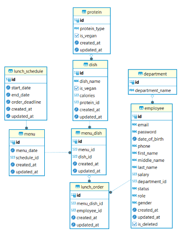

# Company Lunch

This application is used for scheduling and ordering lunch in a company.

## Features

- **Schedule lunch**: HR (ROLE_ADMIN in this project) can create schedule lunch. The application will make sure the meals will be as diverse as possible.
- **View lunch orders in upcoming week** : HR can view all the orders of employees
- **Export lunch orderings**: HR can export the upcoming lunch orders - grouped by departments, to excel files, in order to send to the kitchen.
- **Order lunch**: All employees and HR (ROLE_USER & ROLE_ADMIN) can order lunch

## Technologies & Knowledge applied
- Java core
- Java EE
- JPA - Hibernate
- Authentication & Authorization flow
- Flyway (for data migration)
- RestAPI
- Postgres
- Unit test
- Database design

## ERD

##  Business logic
### 1. Create lunch schedule
- Only HR (ROLE_ADMIN) can create lunch schedule
- Lunch schedules must not overlap with each other
- Start date must not be in the past
- Order deadline must be before start date and is not a date in the past

### 2. Create menu in lunch schedule

### 3. Order lunch

### 4. Export orders in upcoming week to excel file

## Prerequisites

- **JDK 17**: You can download JDK 17 from [here](https://www.oracle.com/java/technologies/javase-jdk17-downloads.html).
- **Wildfly 26**: Download and install Wildfly 26 from [here](https://wildfly.org/downloads/).
- **PostgreSQL 14**: Install PostgreSQL 14. You can find installation instructions [here](https://www.postgresql.org/download/).

## Installation

